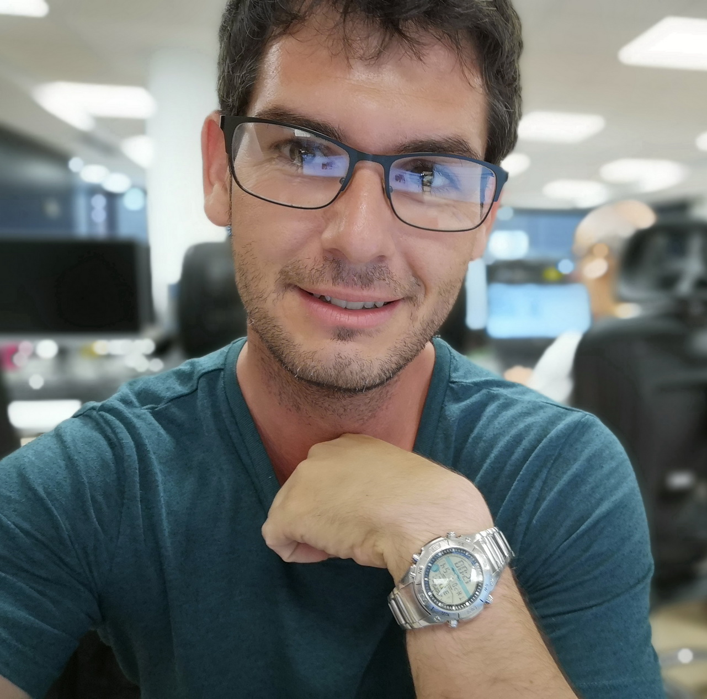

<h1 align="center"> Kenny Reyes </h1>  

  

# Summary

Proactive, methodical, enthusiastic, curious and passionate about learning and mastering new technologies. This has led me to evolve towards an extremely versatile professional, I can learn easily and change between different contexts, parallelize projects or manage national and international customers.

My work and my knowledge go from the initial offer, evolution, the kick-off the project, the architecture design, scaffolding, agile methodologies, teamwork, clean code and code style, testing, DevOps and automation of environments, deploy and the delivery of the project.

In addition, I can teach and build teams and guide them across implementing agile methodologies and good practices.
I will give value to the jobs of technical lead, or 100% remote jobs.

# Experience

## [Plain Concepts](http://www.plainconcepts.com)

I worked in more than 30 projects in different contexts, business needs, and technologies. In addition, I worked providing consulting services for our clients and teaching courses on several topics that I have expertise in.
They have been years of very intensive work, sometimes working on several projects at the same time, so many amazing challenges and of enormous learning and growth in both technical and human skills.

My main roles within the company have been:

- **Development and development lead**: I worked on a wide variety of different projects such as APIs, Webs, Mobile, Bots and desktop applications and technologies like .NET Core, React, MVC5, Bots, Angular, NodeJS, Azure, WPF, UWP, Xamarin, SQL Server, PostgreSQL, Entity Framework and more.
- **Architecture**: Designing the architectures and configure the initial scaffolding for new projects.
- **DevOps Engineering**: Working with Git, Azure, Azure DevOps and Docker providing a deep knowledge to our internal teams and some of our customers.
- **Team Building**: Providing knowledge in agile methodologies, repository management, issues management, good practices and building teams, who work with good coordination, performance and best practices (Gitflow, continuous code review, tests, design patterns, traceability, and clean code)
- **Learning services**: act as a teacher providing mentoring about Git, how to manage repositories and development workflows, DevOps, in addition to agile methodologies with internal and external teams.

I usually was responsible for our customers, national and international ones.

## [Sedecal](http://www.sedecal.com)

Healthcare industrial sector, design, and manufacture of medical equipment such as X-ray machines, TAC, Ozone, PET, Veterinary and portable equipment. I learned a lot about how to manage international clients, work with foreign teams (Japanese, Chinese, British, American), or teamwork with disciplines other than mine, such as mechanical engineers, power or electronics engineers and integrate the software into different systems customized or developed from 0. In addition, I was responsible for the veterinary software, I developed the newest software, including the most ambitious project of the company.

- Design of multitouch applications in medical environments.
- UX designing.
- **MVVM** architecture, modular design with **PRISM** and skinnable GUIs
- Design and animations with Expression Blend
  Design and implementation of the single touch 2 multi-touch console application for X-rays with WPF, MVVM, skinnable, customizable and modular design.
- Design of tools for veterinary editing and manufacturing.
- Deploy license servers, license development GUI design and participation in the development of the multi-touch console of the ChallengeX suspension system console.
- Integration and collaboration with foreign companies.
- Continuous Integration with **Jenkins**. **SCRUM**. **Unit testing**. **Git**.

## [Amper](https://www.grupoamper.com/)

I worked in Amper Programs which is a section of Amper dedicated to military software, and GIS applications.

- Design, analysis, development of interfaces in **GIS** systems. Military command and control applications with **.NET, WPF and WCF, SQL Server**. Architecture **MVVM**, client-server architecture, **SOA** architecture.
- Development of the BNQ war plug-in (bacteriological, nuclear, chemical) for the NE.ON platform. Architecture **DDD**, Architecture **MVVM**.

## Animasoft

I worked in the development department in a commercial software brand. Working on the design and implementation of Windows applications in .NET. Development of applications and commercial tools for SMEs.

- Development and part of the design of the tool for human resource management **GestPeople**. Using **.NET framework, Windows Forms, WPF, Web Services, XMLs, and OLEDB**. Also using code obfuscators, encryption algorithms, InstallShield...
- Issues management and test tools such as Bugtracker and **NUnit**.
- Development and design of the business Web, on **ASP.NET, Silverlight, SQL Server, and hosted in IIS**.
- Start-up of business blogs for SEO functions.
- Design of the error management system and patching system of the company's applications, architecture **SOA** with **WCF**.
- In charge of the architecture and design of the latest project of the company, the document manager _Anaquel_. Development in .NET Framework, client-server architecture. Using for the project **WPF and WCF, XPS, SQL Server, Visual Studio and Expression Blend**.
- Project risk analysis.
- Supporting the marketing department.

## [Alma Technologies](http://www.almatech.es/)

R&D department, I worked on search engine interfaces and internal projects **(.NET)**

- Design and development of the status monitor, the administration application that controls the search system, I also took part in the development of the search solution project for the CNI (national intelligence center). Developed in C#, **using Web Services, Active Directory Queries, Oracle database queries, and XML processing**.
- Developed the Web administration interface of the project. Using **C#, ASP.NET AJAX, javascript and CSS**.

# Skills

## Already had

- Patterns
- Clean code
- .NET Full Framework
- CSharp (C#)
- Agile
- IC
- WPF
- Insdustrial Software
- Healthcare industry
- Integrations with equipment
- Software archicture
- Solid principles
- Git
- Testing
- UWP
- Git
- Agile methodologies
- Testing
- Clean code
- SQL Server
- Oracle
- Entity Framework
- LINQ
- ASP .NET MVC
- ASP. NET Web Api
- WCF (Windows Communication Foundation)
- Solid principles
- DDD
- IoC

## Newest skills

- .NET Core
- EF Core
- Mobility UWP
- Mobility Xamarin
- Customer care
- MVC 5
- MVC Core
- Bots
- Angular
- CSS
- Teaching
- javascript
- NodeJS
- DevOps (Azure DevOps, Genkins)
- React
- Multiple architectures
- Cognitive
- Azure
- Some stuff of manage teams
- Motivation
- Architecture patterns
- Docker
- Mood and diplomacy
- Deft touch
- Sonar Qube
- Pull requests

## Learning

- Testing in frontend
- Kubernetes
- Python
- Big Data
- Rust
